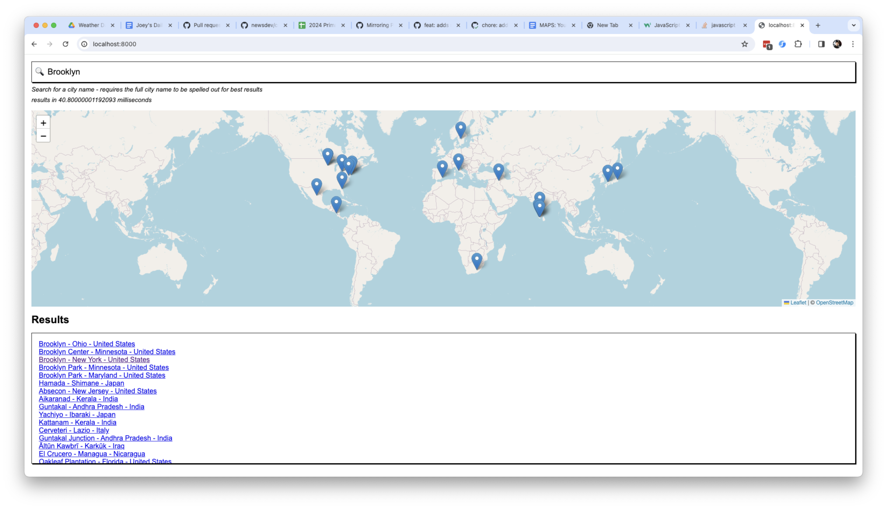

# README



A tiny, quick and dirty demo using [tinysearch](https://github.com/tinysearch/tinysearch/tree/master) to create a geocoder using wasm for city level search in the browser

We could optimize this to be smaller, but for now this loads ~5.5mb of data into the browser and takes about 12ms to load the wasm file and 80ms to load the page.

Demo adpated from the `wasm_output` of https://github.com/tinysearch/tinysearch?tab=readme-ov-file#usage

## Data
* derived from https://simplemaps.com/data/world-cities --> 47,000 city entries!

## Links to: 
* geojson.io


## run it locally

```
python3 -m http.server
```